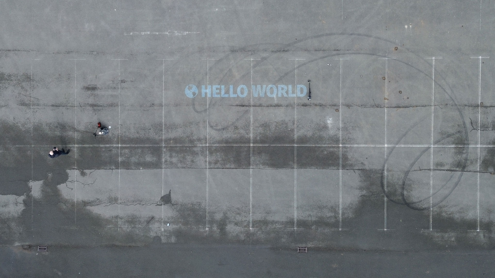

Software and Hardware for a portable chalk printer.

---

### Hardware/CAD

Refer to the [CAD directory](/CAD) for STEP and Fusion360 files for the whole assembly. OpenBuild components are not included in the models.

### Electronics

The chalk printer is controlled by [klipper](https://www.klipper3d.org/) running on a Raspberry Pi Zero 2W and a [BigTreeTech SKR-Pico](https://github.com/bigtreetech/SKR-Pico/tree/master). Configuration files are located in the [klipper directory](/klipper).

### Software

Gcode processing is done by a python script accessible via a flask webserver. The server can either be installed manually on the Raspberry Pi running klipper or can be run in a docker container.